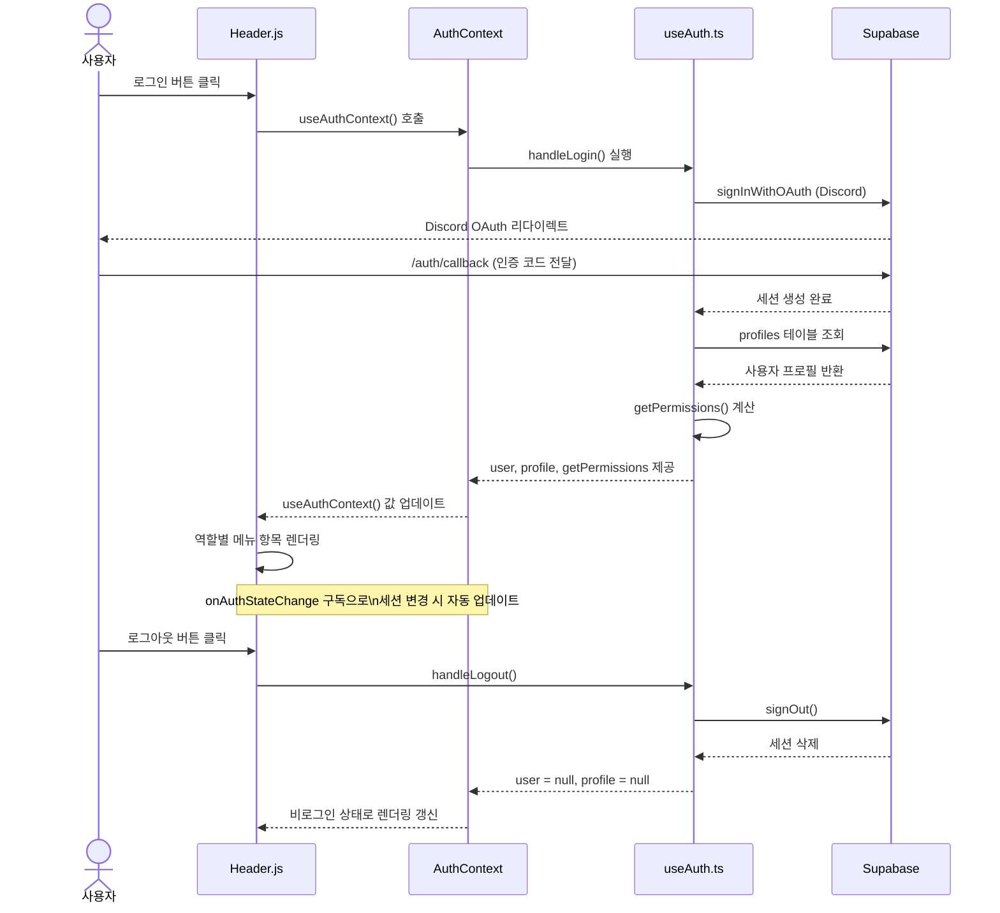
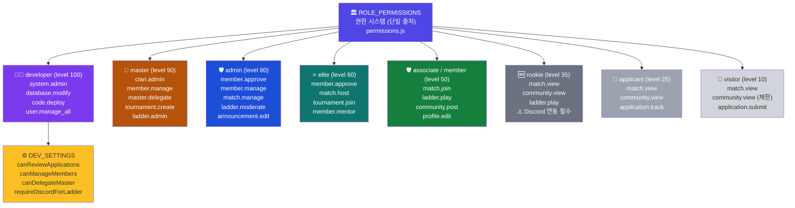
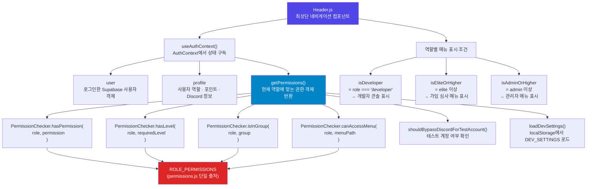
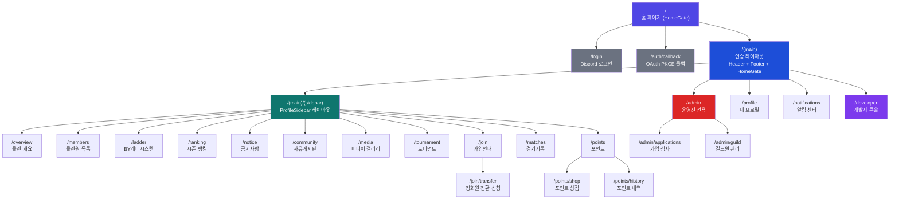

# 📊 ByClan Web — 시각화 다이어그램

ByClan Web의 핵심 구조와 흐름을 Mermaid 다이어그램으로 시각화한 문서입니다.  
GitHub에서 자동으로 렌더링되며, 별도 도구 없이 바로 확인할 수 있습니다.

---

## 목차

1. [인증 흐름 (Flowchart)](#1-인증-흐름)
2. [역할 상태 다이어그램 (State Diagram)](#2-역할-상태-다이어그램)
3. [컴포넌트 상호작용 (Sequence Diagram)](#3-컴포넌트-상호작용)
4. [권한 계층도 (Graph)](#4-권한-계층도)
5. [함수 호출 계층 (Flowchart)](#5-함수-호출-계층)
6. [데이터 레이어 관계도 (ER Diagram)](#6-데이터-레이어-관계도)
7. [권한 검증 플로우 (Flowchart)](#7-권한-검증-플로우)
8. [라우팅 트리 (Graph)](#8-라우팅-트리)

---

## 관련 문서

| 문서 | 설명 |
|------|------|
| [CODE-STRUCTURE.md](./CODE-STRUCTURE.md) | 전체 코드 구조 (텍스트) |
| [guides/DATABASE-GUIDE.md](./guides/DATABASE-GUIDE.md) | DB 스키마 및 쿼리 가이드 |
| [guides/ENVIRONMENT-SETUP.md](./guides/ENVIRONMENT-SETUP.md) | 개발 환경 설정 |

---

## 1. 인증 흐름

초기 진입부터 세션 수립, 권한 계산까지의 전체 인증 흐름입니다.

```mermaid
flowchart TD
    A([🌐 브라우저 진입 /]) --> B{HomeGate\n비밀번호 확인}
    B -- ❌ 미입력 --> C[비밀번호 입력 화면]
    C -- 올바른 비밀번호 --> D
    B -- ✅ 통과 --> D{로그인 여부 확인}

    D -- 미로그인 --> E[/login\nImprovedAuthForm]
    E --> F[Discord OAuth 인증 화면]
    F --> G[/auth/callback\nPKCE 코드 교환]
    G --> H[(Supabase\n세션 생성)]

    D -- 이미 로그인 --> I
    H --> I[useAuth 초기화]

    I --> J[supabase.auth.getSession 호출]
    J --> K[(profiles 테이블 조회)]

    K -- 프로필 없음 --> L[visitor 프로필 자동 생성]
    K -- role = applicant --> M[가입 대기 화면 표시]
    K -- 정식 멤버 --> N[Discord 정보 자동 갱신]

    L --> O
    N --> O[getPermissions 권한 계산]
    O --> P[AuthContext 전체 앱 제공]
    P --> Q([✅ 페이지 렌더링 완료])

    style A fill:#4f46e5,color:#fff
    style Q fill:#16a34a,color:#fff
    style H fill:#0284c7,color:#fff
    style M fill:#dc2626,color:#fff
```

---

## 2. 역할 상태 다이어그램

사용자 역할의 생명주기와 각 전환 조건을 보여줍니다.

```mermaid
stateDiagram-v2
    [*] --> visitor : 첫 방문 (비로그인)
    visitor --> applicant : Discord 로그인 + 가입 신청

    applicant --> rookie : 운영진 승인\n(admin / elite 이상)
    applicant --> visitor : 가입 거절

    rookie --> associate : 정회원 전환 신청\n+ 운영진 승인
    rookie --> member : 정회원 전환 신청\n+ 운영진 승인

    associate --> elite : 활동 기여 + 운영진 승인\n(level 50 → 60)
    member --> elite : 활동 기여 + 운영진 승인\n(level 50 → 60)

    elite --> admin : master 이상 임명\n(level 60 → 80)
    admin --> master : master 위임\n(level 80 → 90)

    master --> admin : 강등\n(level 90 → 80)
    admin --> elite : 강등\n(level 80 → 60)
    elite --> associate : 강등 (level 60 → 50)

    note right of developer
        개발자 역할은 별도 채널로 부여됩니다.
        시스템 레벨: 100 (최고 권한)
    end note

    note right of visitor
        level: 10
        match.view, community.view(제한)
        application.submit
    end note

    note right of applicant
        level: 25
        가입 신청 추적 가능
        대기 화면으로 이동
    end note

    note right of rookie
        level: 35
        Discord 연동 필수
        ladder.play 가능
    end note

    note right of associate
        level: 50
        community.post, profile.edit 가능
    end note

    note right of elite
        level: 60
        member.approve, match.host 가능
    end note

    note right of admin
        level: 80
        member.manage, ladder.moderate 가능
    end note

    note right of master
        level: 90
        clan.admin, master.delegate 가능
    end note
```

---

## 3. 컴포넌트 상호작용

사용자 로그인부터 Header 렌더링까지의 컴포넌트 간 메시지 흐름입니다.



---

## 4. 권한 계층도

각 역할의 레벨과 보유 권한을 계층 구조로 표시합니다.



---

## 5. 함수 호출 계층

`Header.js`에서 시작하는 핵심 함수 호출 흐름입니다.



---

## 6. 데이터 레이어 관계도

Supabase 테이블 간의 관계를 ER 다이어그램으로 표시합니다.

```mermaid
erDiagram
    AUTH_USERS {
        uuid id PK
        string email
        string provider
    }

    PROFILES {
        uuid id PK_FK
        string ByID "클랜 닉네임"
        string role "역할 (developer~visitor)"
        string discord_id "Discord 고유 ID"
        string discord_name "Discord 유저명"
        int Ladder_MMR "래더 레이팅"
        bool is_in_queue "래더 대기 상태"
        bool vote_to_start "대기열 투표 여부"
        int points "활동 포인트"
        string race "종족 (T/P/Z)"
        text intro "자기소개"
        int wins "래더 승리 수"
        int losses "래더 패배 수"
        string queue_joined_at "대기열 진입 시간"
    }

    LADDER_MATCHES {
        uuid id PK
        string status "pending/active/completed"
        string match_type "1v1/2v2/3v3"
        uuid[] team_a_ids "팀A 멤버 ID 배열"
        uuid[] team_b_ids "팀B 멤버 ID 배열"
        int score_a "팀A 점수"
        int score_b "팀B 점수"
        uuid created_by FK
        timestamp created_at
    }

    NOTIFICATIONS {
        uuid id PK
        uuid user_id FK
        string title "알림 제목"
        text message "알림 내용"
        bool is_read "읽음 여부"
        timestamp created_at
    }

    APPLICATIONS {
        uuid id PK
        uuid user_id FK
        string status "pending/approved/rejected"
        text content "가입 신청 내용"
        timestamp created_at
    }

    developer_settings {
        string key PK
        jsonb value "설정값 (JSON)"
        timestamp updated_at
    }

    AUTH_USERS ||--|| PROFILES : "1:1 (id)"
    PROFILES ||--o{ LADDER_MATCHES : "1:N (created_by)"
    PROFILES ||--o{ NOTIFICATIONS : "1:N (user_id)"
    PROFILES ||--o{ APPLICATIONS : "1:N (user_id)"
```

---

## 7. 권한 검증 플로우

`PermissionChecker.hasPermission()` 내부의 검증 로직 흐름입니다.

```mermaid
flowchart TD
    START(["hasPermission(\n  role, permission\n)"])

    START --> R1{role이\n유효한가?}
    R1 -- 없음/null --> DENY1(["❌ false 반환\n(visitor 권한 없음)"])
    R1 -- 있음 --> R2{ROLE_PERMISSIONS에\n해당 역할 존재?}

    R2 -- 없음 --> DENY2(["❌ false 반환\n(알 수 없는 역할)"])
    R2 -- 있음 --> R3{role === 'developer'?}

    R3 -- Yes --> R4{DEV_SETTINGS\n제한 설정 확인}
    R4 -- canReviewApplications=false\n& permission=member.approve --> DENY3(["❌ false 반환\n(개발자 설정으로 제한됨)"])
    R4 -- 제한 없음 --> ALLOW1(["✅ true 반환\n(개발자 전체 권한)"])

    R3 -- No --> R5{ROLE_PERMISSIONS[role]\n.permissions 배열에\npermission 포함?}
    R5 -- Yes --> ALLOW2(["✅ true 반환"])
    R5 -- No --> DENY4(["❌ false 반환"])

    style START fill:#4f46e5,color:#fff
    style ALLOW1 fill:#16a34a,color:#fff
    style ALLOW2 fill:#16a34a,color:#fff
    style DENY1 fill:#dc2626,color:#fff
    style DENY2 fill:#dc2626,color:#fff
    style DENY3 fill:#dc2626,color:#fff
    style DENY4 fill:#dc2626,color:#fff
```

---

## 8. 라우팅 트리

Next.js App Router 기반의 전체 라우팅 구조입니다.



---

## 다이어그램 요약

| # | 다이어그램 | 유형 | SVG 파일 |
|---|-----------|------|----------|
| 1 | 인증 흐름 | Flowchart | [auth-flow.svg](diagram-gallery/auth-flow.svg) |
| 2 | 역할 상태 | State Diagram | (Mermaid 전용 — 위 코드 블록 참조) |
| 3 | 컴포넌트 상호작용 | Sequence Diagram | (Mermaid 전용 — 위 코드 블록 참조) |
| 4 | 권한 계층도 | Graph | [role-hierarchy.svg](diagram-gallery/role-hierarchy.svg) |
| 5 | 함수 호출 계층 | Flowchart | [component-dependency.svg](diagram-gallery/component-dependency.svg) |
| 6 | 데이터 관계 | ER Diagram | [data-layer.svg](diagram-gallery/data-layer.svg) |
| 7 | 권한 검증 플로우 | Flowchart | (Mermaid 전용 — 위 코드 블록 참조) |
| 8 | 라우팅 트리 | Graph | (Mermaid 전용 — 위 코드 블록 참조) |

> 💡 **팁**: GitHub 마크다운에서 Mermaid 코드 블록은 자동으로 렌더링됩니다.  
> VS Code에서는 [Mermaid Preview](https://marketplace.visualstudio.com/items?itemName=bierner.markdown-mermaid) 확장으로 로컬에서도 확인할 수 있습니다.
